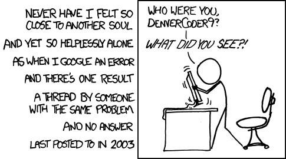

We’ve heard it in nearly all of our classes: “there’s no such thing as a stupid question”, or “you should ask questions now because chances are, several other students have the same questions.” 

But come on. 
You don’t actually that, do you? I mean, I remember back in elementary school (and even in college sadly) hearing that whinnying student ask, “what’s the point of learning…” insert difficult topic here. Or even worse. Ask questions they could have found answers to in an assignment, course lectures, or even Google, gasp! 

As software engineers, we’re sort of forced to desperately resort to looking through textbooks and sadly revisiting the same top ten google searched sites for the umpteenth time in an effort to debug our nonfunctioning codes. It’s enough to make any student go crazy!!!

I mean, if you don't become a "Google expert" during your college years as a software engineer then you're doing something terribly wrong. Or, you're a genius and have never had to look for help 'cause you're so awesome and all! Gah! Lucky you! But for the rest of us, there are times where we need to look to the software engineering community for guidance. And ya know, some software engineers can be downright brutal--to some and incredibly helpful to others.

For example, take a look at this question: 

