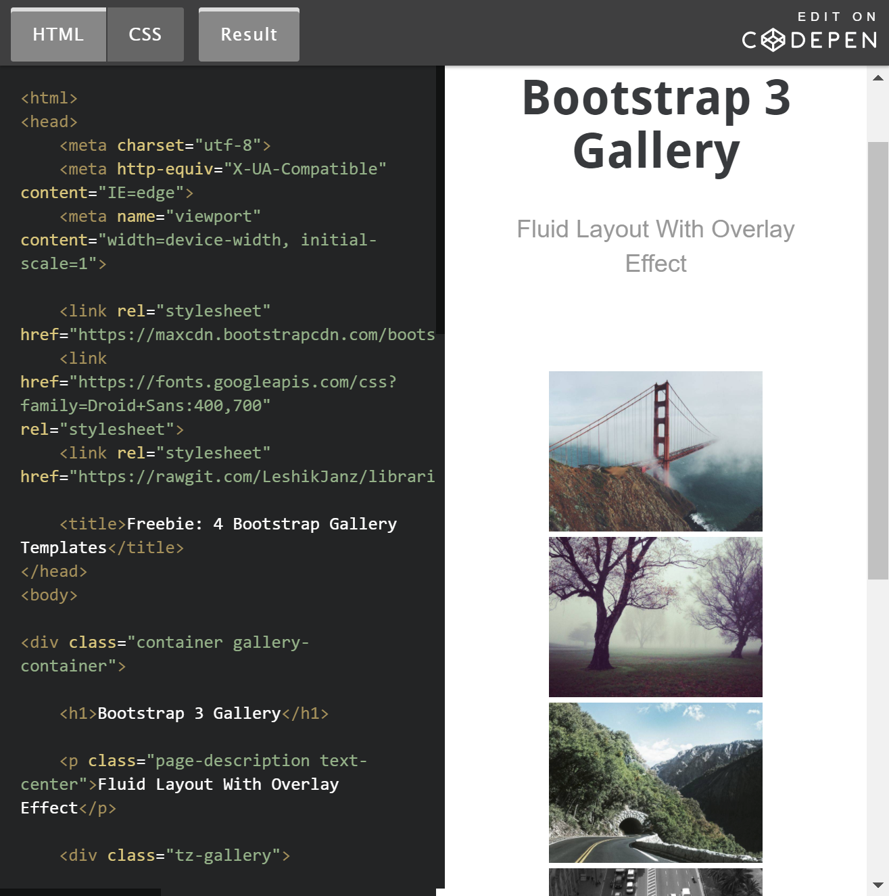

## Which to Choose?
There are different types of frameworks you can choose from when building a website: Bootstrap, Semantic-UI, Foundation, Materialize, etc.? But which is right for you? To be fair, I’ve only had experience with Semantic-UI; however, upon some initial research, I stumbled across a quote when comparing Semantic-UI vs. Bootstrap: 

>In English, it’s much easier to say "There are three tall men" than "There is a tall man, a tall man, and a tall man". This means that in Bootstrap, to achieve a thing (say a navbar), we need to have 2-3 nested classes of “navbar”, ”navbar-default”, etc. whereas with Semantic UI, it can be done with single one. /s/s Source: <a href="http://opntec.org/choosing-semantic-ui-over-bootstrap-for-the-open-event-front-end/">Choosing Semantic UI over Bootstrap for the Open Even Front-end:</a>

## Yikes!
Yikes! That statement alone is enough to send any beginning software engineer (such as myself) into hysterics! Especially after discovering it is required that we also be acquainted to Bootstrap!!! After some further investigation I noticed some interesting contrasts between the two frameworks:

## This is Just the Beginning

## NEXT2

## NEXT3

