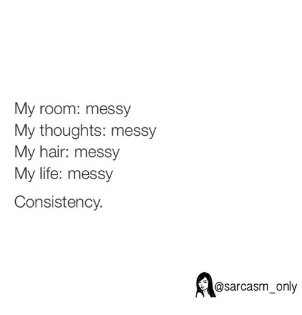
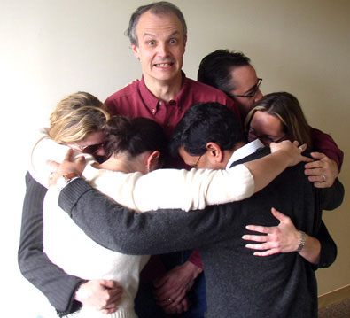

## Once upon a time in ICS 212…
So I used to get all worked up and anxious when I’d turn in my coding homework that I felt was flawless. I’d cover my eyes with one hand and quickly click the “submit” button with another. But why should I feel nervous? I mean, my code worked. It did what it needed to do. So…I should get an A right? But no. A few days later I’d check my grade online only to discover that an assignment that I spent 5 hours on got a freaking 70%?! Yeah a C-! We might as well call it a D. 

But why? 

I’d look at the feedback the TA would provide, and it’d be a -30% for…wait for it—FORMATTING!!!! ARG!!!!!

## What will be printed?
Here’s a question that was asked in one of my coding course exams:

**What will be printed?**
```
Int value = 2;
Int product = 1;

While( product <= 3)
  Product = product * value;
  Product=+2;
Printf(“The value of this product is %d\n”, product);
```
I seriously thought this was a trick question. And gasp! It was! My thought was: well um… he must have meant to include the braces within the while loop so yeah it’s a typo. I’m going to write that the print statement is going to print that “The value of this produce is 2”. Yeah that’s the correct answer! 😊

**WRONG!!!** 

It wasn’t a typo! The answer was that the program would go on forever since the update would not be considered (due to the missing braces of course). Not surprisingly a lot of students got this question wrong—and it wasn’t for the same reason I did. Due to the indentations, many students assumed that the two lines after the while loop were included. After we reviewed our exam the professor emphasized the importance of—FORMATING!!!! ARG!!!!!

## Have you ever…
Looked at another person’s code and think. Ummm wow. Why? As in, it’s so disorganized. So bad. That you have no idea where to even begin debugging? 


A wise professor once said that the BEST codes are the ones that are the most easiest to read. Who cares if you can solve an algorithm in 10 lines. Whoopdee-doo! If its wrong and unreadable its going to be very difficult to get another colleague to debug it. This is why coding standards are so important! I used to think that it was so unfair getting docked 30% on a coding assignment for formatting issues. However, after working with other people and debugging their code you become THANKFUL they’re in place. Coding standards keeps everyone consistent—on the same page! From the neatest of the neat freaks to the messiest of slobs coding standards (in a cheesy way) is what brings us software engineers together. Group hug!!!!




